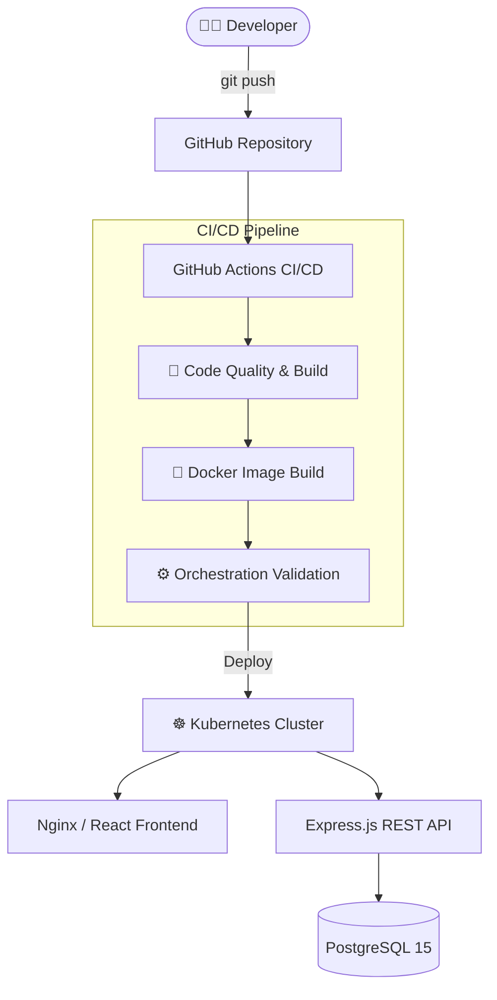

# 🎓 Faculty Management System


A full-stack, containerized **Faculty Management System** built with modern DevOps practices — featuring automated CI/CD pipelines, multi-stage Docker containers, Kubernetes orchestration, and Ansible-based server provisioning.

---

## 📐 Architecture Overview



---

## ✨ DevOps Highlights

| Feature | Technology | Detail |
|---|---|---|
| **CI/CD** | GitHub Actions | 3-stage automated pipeline on every push |
| **Containerization** | Docker | Multi-stage Alpine builds for minimal image size |
| **Orchestration** | Kubernetes | Deployments with resource limits & readiness probes |
| **Config Management** | Ansible | Automated server provisioning & Docker deployment |
| **Reverse Proxy** | Nginx | API proxying, gzip compression, static asset caching |
| **Database** | PostgreSQL 15 | Connection pooling, init scripts, persistent volumes |
| **Secret Management** | K8s Secrets | Credentials injected via `secretKeyRef` — never hardcoded |

---

## 🗂️ Project Structure

```
faculty-management-system/
├── .github/
│   └── workflows/
│       └── ci-cd.yml           # 3-stage GitHub Actions CI/CD pipeline
│
├── backend/
│   ├── Dockerfile              # Production Node.js Alpine container
│   ├── server.js               # Express.js REST API (Auth + Faculty CRUD)
│   ├── db.js                   # PostgreSQL connection pool with limits
│   ├── middleware/auth.js       # JWT authentication middleware
│   ├── init.sql                # Database initialization & seed script
│   ├── .env.example            # Documented environment variable template
│   └── package.json
│
├── frontend/
│   ├── Dockerfile              # Multi-stage build → Nginx Alpine container
│   ├── nginx.conf              # Production proxy with caching & API routing
│   ├── src/
│   │   ├── App.js              # React dashboard UI
│   │   └── App.css             # Dark-mode styling
│   └── package.json
│
├── k8s/
│   └── deployment.yml          # K8s Deployments, Services, resource limits
│
├── ansible/
│   └── deploy.yml              # Server provisioning & Docker deployment playbook
│
├── docker-compose.yml          # Full production stack (backend + frontend + db)
├── docker-compose.dev.yml      # Dev environment (PostgreSQL only)
└── README.md
```

---

## 🔄 CI/CD Pipeline

Three automated stages run on every push to `main`:

```
Push to main
    │
    ▼
┌─────────────────────────┐
│  🧪 Code Quality & Build │  → npm ci (backend + frontend)
│                         │  → React production build (CI=false)
└────────────┬────────────┘
             │
             ▼
┌─────────────────────────┐
│  🐳 Docker Container     │  → Build backend image (Node 18 Alpine)
│     Build               │  → Build frontend image (multi-stage Nginx)
└────────────┬────────────┘
             │
             ▼
┌─────────────────────────┐
│  ⚙️ Orchestration        │  → Validate docker-compose configs
│     Validation          │  → Verify deployment manifests
└─────────────────────────┘
```

---

## 🚀 Quickstart

### Local Development with Docker Compose

```bash
# Clone the repository
git clone https://github.com/NouraizVirk/faculty-management-system.git
cd faculty-management-system

# Configure environment
cp backend/.env.example backend/.env

# Start the full stack
docker compose up -d --build

# Access the app
# → Frontend: http://localhost
# → Backend API: http://localhost:5000
# → Database: localhost:5432

# Stop everything
docker compose down -v
```

### Kubernetes Deployment

```bash
# Apply manifests
kubectl apply -f k8s/deployment.yml

# Check pod status
kubectl get pods
kubectl get services
```

### Ansible Server Provisioning

```bash
# Provision a fresh Ubuntu server and deploy
ansible-playbook -i inventory.ini ansible/deploy.yml --become
```

---

## 🔌 API Reference

| Method | Endpoint | Auth | Description |
|---|---|---|---|
| `POST` | `/api/auth/register` | ❌ | Register a new user |
| `POST` | `/api/auth/login` | ❌ | Login and get JWT token |
| `GET` | `/api/faculty` | ✅ JWT | Get all faculty members |
| `GET` | `/api/faculty/:id` | ✅ JWT | Get a single faculty member |
| `POST` | `/api/faculty` | ✅ JWT | Add a new faculty member |
| `PUT` | `/api/faculty/:id` | ✅ JWT | Update a faculty member |
| `DELETE` | `/api/faculty/:id` | ✅ JWT | Remove a faculty member |
| `GET` | `/api/stats` | ✅ JWT | Get dashboard statistics |

---

## 🛠️ Tech Stack

**Backend:** Node.js 18, Express.js, PostgreSQL 15, JWT, bcryptjs  
**Frontend:** React 18, React Router, Nginx  
**DevOps:** Docker, Docker Compose, Kubernetes, Ansible, GitHub Actions

---

## 📄 License

MIT License — feel free to use and adapt.
