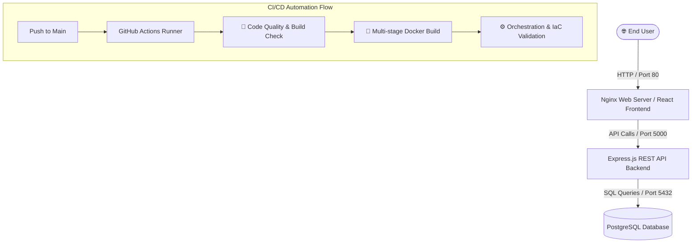

# 🎓 Faculty Management System — DevOps Architecture & CI/CD Pipeline


A full-stack, containerized **Faculty Management System** built with **Express.js**, **React**, and **PostgreSQL**, engineered with modern DevOps principles including **Automated CI/CD Pipelines**, **Multi-stage Docker Containers**, and **Infrastructure-as-Code Orchestration**.

---

## 📐 Architecture Overview



---

## ✨ Key DevOps & Technical Highlights

- 🔄 **Automated CI/CD Pipeline**: Continuous Integration using GitHub Actions featuring automated dependency checks, frontend static production builds, multi-stage Docker image verification, and orchestration config parsing.
- 🐳 **Containerization Best Practices**: Optimized multi-stage Dockerfiles utilizing Alpine base images to minimize image footprint and improve security.
- ⚙️ **Production Container Orchestration**: Complete `docker-compose.yml` environment linking database, backend API, and static frontend proxy.
- 🔐 **Secure Authentication**: Express backend featuring JWT authentication and bcrypt password hashing.

---

## 🛠️ Tech Stack

| Component | Technology |
| :--- | :--- |
| **Frontend** | React, React Router, Nginx (Production Proxy) |
| **Backend** | Node.js, Express.js, JWT, bcryptjs |
| **Database** | PostgreSQL 15 |
| **Containerization** | Docker, Docker Compose |
| **CI/CD** | GitHub Actions |

---

## 🚀 Quickstart (Local Deployment)

### Prerequisites
- [Docker & Docker Desktop](https://www.docker.com/) installed
- [Git](https://git-scm.com/)

### Running with Docker Compose

1. **Clone the repository:**
   ```bash
   git clone https://github.com/NouraizVirk/Faculty-Management-System.git
   cd Faculty-Management-System
   ```

2. **Start the application stack:**
   ```bash
   docker compose up -d --build
   ```

3. **Access the application:**
   - 🌐 **Frontend App:** [http://localhost](http://localhost)
   - 🔌 **Backend API:** [http://localhost:5000](http://localhost:5000)
   - 🗄️ **PostgreSQL DB:** `localhost:5432`

4. **Stop the stack:**
   ```bash
   docker compose down -v
   ```

---

## ⚙️ CI/CD Pipeline Architecture

The automated pipeline defined in `.github/workflows/ci-cd.yml` executes three stages on every commit:

1. **Build & Test Stage**: Sets up Node.js 18, installs dependencies, and verifies React static compilation.
2. **Container Build Stage**: Verifies Dockerfile execution for both backend and frontend environments using Docker Buildx.
3. **Orchestration Verification**: Validates Docker Compose files (`docker-compose.yml`, `docker-compose.dev.yml`) to ensure configuration integrity before deployment.

---

## 📁 Repository Structure

```
.
├── .github/
│   └── workflows/
│       └── ci-cd.yml             # Primary GitHub Actions CI/CD Pipeline
├── backend/
│   ├── Dockerfile                # Production Node.js Alpine Container Definition
│   ├── server.js                 # Express REST API
│   ├── db.js                     # PostgreSQL Connection Pool & Initialization
│   └── package.json
├── frontend/
│   ├── Dockerfile                # Multi-stage Nginx Container Definition
│   └── package.json
├── docker-compose.yml            # Production Multi-container Stack Definition
├── docker-compose.dev.yml        # Development PostgreSQL Service Setup
└── README.md
```

---

## 📄 License
This project is licensed under the MIT License.
